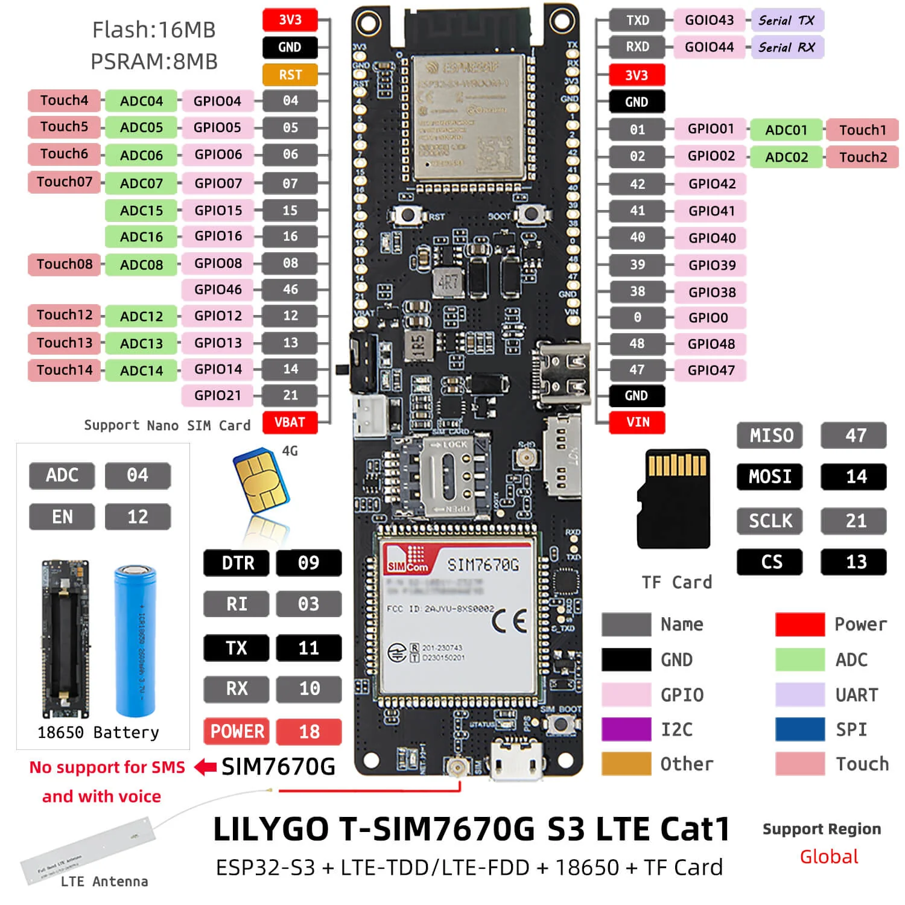
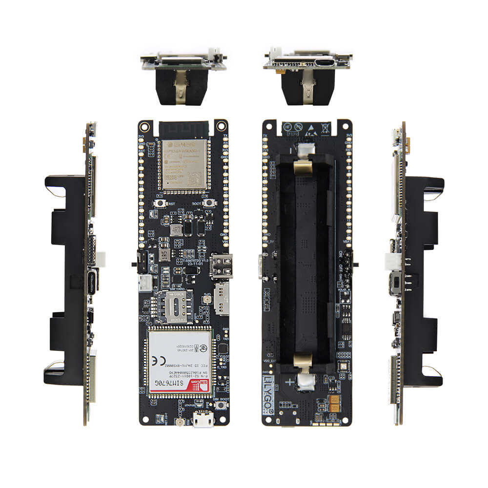
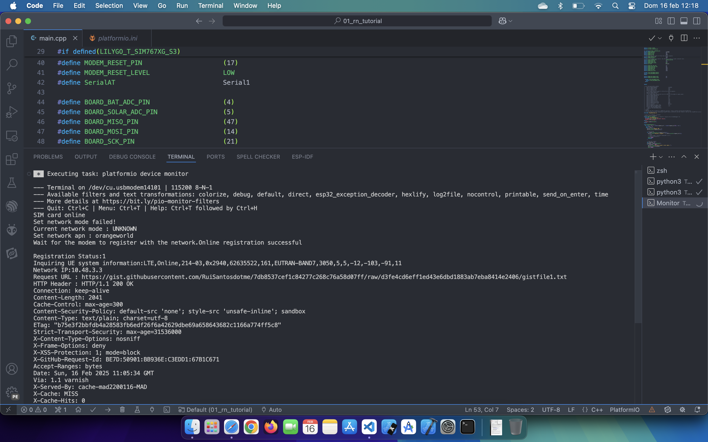
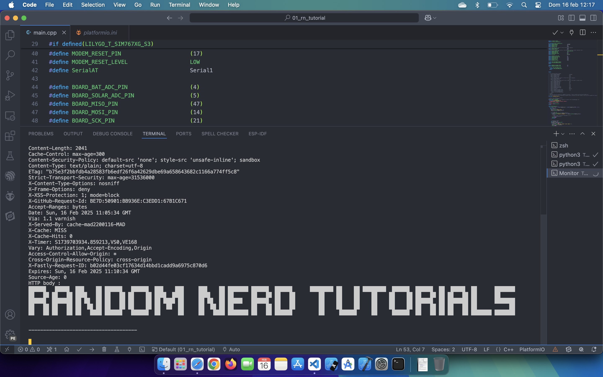

# Primeros pasos con LILYGO TTGO T-SIM7670G S3

Siguiendo este tutorial [Primeros pasos con LILYGO TTGO T-A7670G ESP32 (4G, GPRS y GPS)](https://randomnerdtutorials.com/lilygo-ttgo-t-a7670g-a7670e-a7670sa-esp32/) de Random Nerd tutorials para una placa muy similar a la que yo voy a usar [T-A7670G](https://lilygo.cc/products/t-sim-a7670e?_pos=1&_sid=c4758edb2&_ss=r&variant=43043706077365)  

Yo usaré la [T-SIM7670G S3](https://lilygo.cc/products/t-sim-7670g-s3) y estas son las diferencias más importantes entre los dos proyectos:  

|  | T-A7670G | T-SIM7670G S3 |
|-----------|-----------|-----------|
| MCU    | ESP32    | ESP32-S3    |
| LTE&GSM    | A7670E    | SIM7670G    |
| SIM    | vodafone    | simyo    |

A pesar de todas estas diferencias este proyecto funciona con unos pequeños cambios respecto al original. 

La placa [T-SIM7670G S3](https://lilygo.cc/products/t-sim-7670g-s3) combina el chip ESP32-S3, el módulo SIM7670G, la ranura para tarjeta SIM, la tarjeta microSD, el GPS, la batería y el cargador en la misma placa. Además de Wi-Fi y Bluetooth, puede comunicarse con esta placa ESP32-S3 usando SMS. También puede conectarlo a Internet utilizando su plan de datos de tarjeta SIM y obtener la ubicación GPS.

Puede encontrar más información en el [repositorio oficial de LilyGO-T-A76XX GitHub](https://github.com/Xinyuan-LilyGO/LilyGO-T-A76XX).  

Además del módulo SIM7670G, la placa también viene con algunas características interesantes como un soporte de batería para una batería 18650, un circuito de carga de batería donde puede conectar paneles solares para recargar la batería y una ranura para tarjetas microSD que puede ser útil para proyectos de registro de datos o para guardar ajustes de configuración.

  

  

  

Siguiendo el tutorial y una vez modificadas las diferencias entre las placas usadas, he conseguido hacer una petición http con una sim del operador simyo que cuestan 2 euros 4 gigas. 

El resultado ha sido el siguiente:

  

  

  

