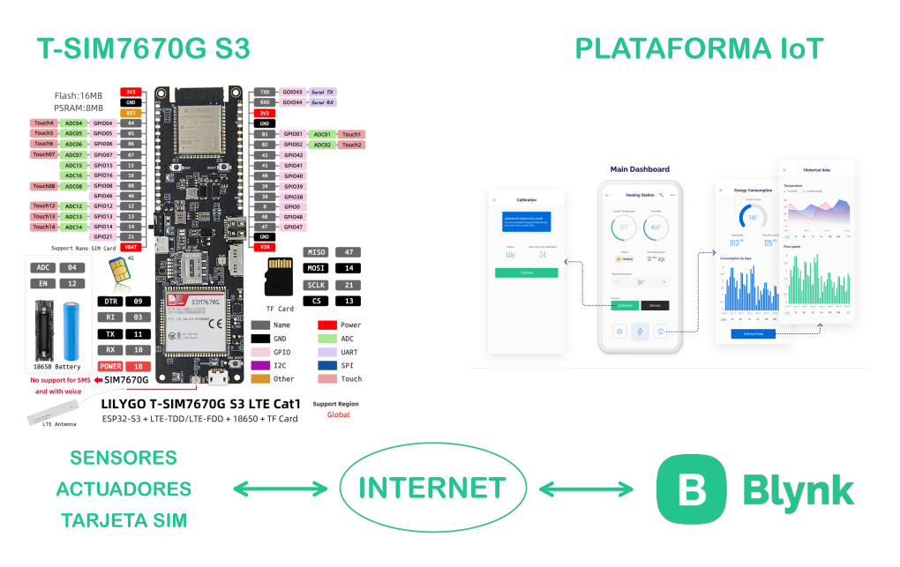
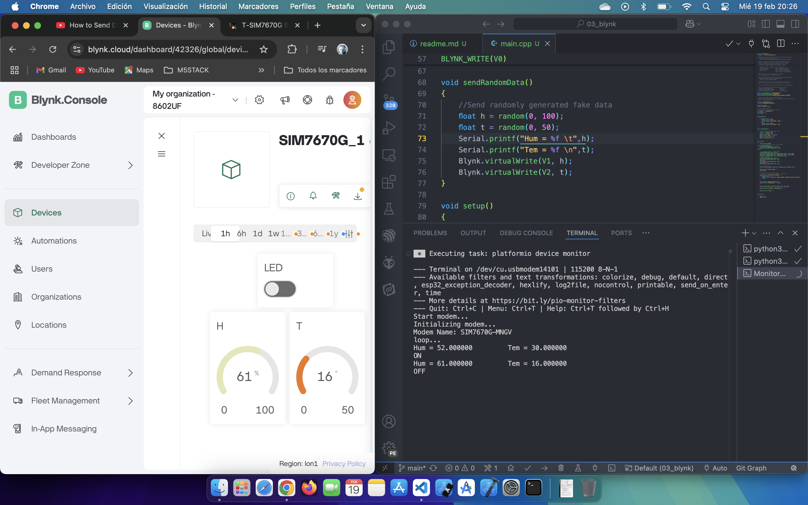

## Comunicación con Blynk 

He seguido este [tutorial](https://youtu.be/tF_C6L95yk4?si=bVP9DWDqfhA0uHKP) adaptándolo a la placa que yo uso y todo ha funcionado según lo esperado. 

El resultado ha sido el siguiente:

  

  

  

  
