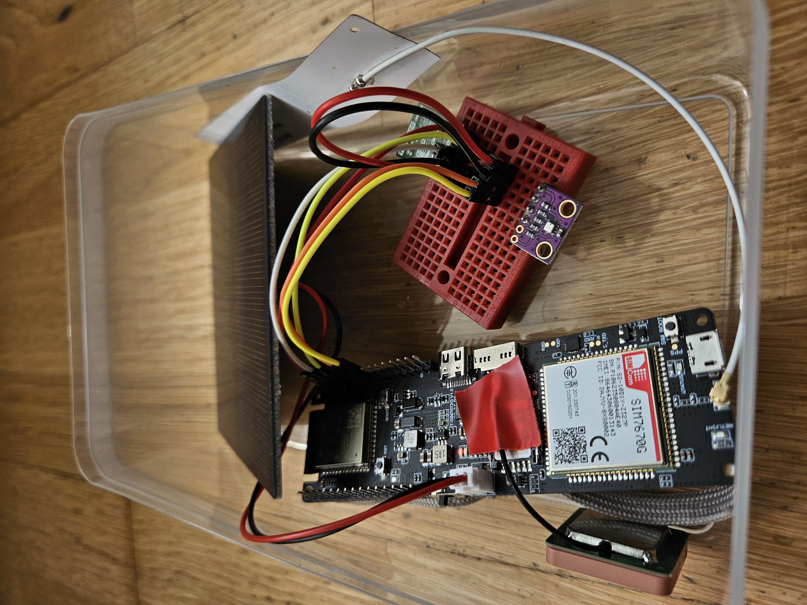

## Comunicación con Blynk Low Power 

La idea es sólo enviar datos periódicamente (cada 30 segundos en el código para pruebas) y pasar el resto del tiempo en modo dormido para poder alimentar el dispositivo con batería.

El resultado ha sido el siguiente:

  

  

  

He estado probando durante dos semanas el envío de datos a Blynk cada 15 minutos con una pila 18650 de 2800 mA. No hay ningún sensor conectado, la batería ha aguantado y el consumo de datos de la tarjeta sim es muy pequeño. Objetivo conseguido. 

| Consumo de datos | Blynk |
|----------|----------|
|  |  |

## Conexión de alimentación de sensores 

El siguiente paso es conectar sensores pero de una forma eficiente y que no consuman corriente mientras no se estén leyendo. Asi que el TPS22860 será el interruptor de la alimentación de los sensores y controlado por el ESP32S3. 

  

  

## Sensor BME280 

La prueba será ver cuanto dura la batería del T-SIM7670G S3 con un sensor BME280 cuya alimentación estará controlada con el TPS22860. También conectaré un panel solar aunque de momento solo lo usare en interior cercano a una ventana.   

### Lista de Componentes  

| Componente       | Cantidad | Enlace de Referencia |
|-----------------|----------|----------------------|
| T-SIM7670G S3          | 1        | [T-SIM7670G S3](https://lilygo.cc/products/t-sim-7670g-s3?srsltid=AfmBOopNVR0tYjRg3W6ErZyGzwzb7GfMuTD-1el0HQcmgLmuWGyV-mxV) |
| PANEL SOLAR        | 1        | [PANEL SOLAR](https://www.seeedstudio.com/1W-Solar-Panel-80X100.html?srsltid=AfmBOore5kdLbWt3hDgXTxJEiYHr_dW26GwcHpYm3g6S4X7S3oLIQ9kY) |
| TPS22860        | 1        | [TPS22860](https://www.tindie.com/products/closedcube/tps22860-ultra-low-leakage-load-switch/) |
| BME280          | 1        | [BME280](https://randomnerdtutorials.com/esp32-bme280-arduino-ide-pressure-temperature-humidity/) |

### Conexión entre T-SIM7670G S3 y TPS22860

| **T-SIM7670G S3** | **Conexión**  | **TPS22860**        |
|--------------------|--------------|---------------------|
| GPIO01            | ────────  | ON                 |
| 3V3               | ────────  | VIN                |
| GND               | ────────  | GND                |

### Conexión entre TPS22860 y BME280

| **TPS22860** | **Conexión**  | **BME280**        |
|--------------------|--------------|---------------------|
| GND            | ────────  | GND                 |
| VOUT            | ────────  | VCC                 |

### Conexión entre T-SIM7670G S3 y BME280

| **T-SIM7670G S3** | **Conexión**  | **BME280**        |
|--------------------|--------------|---------------------|
| GPIO42            | ────────  | SCL                 |
| GPIO41            | ────────  | SDA                 |

### Resultado provisional
  

  

