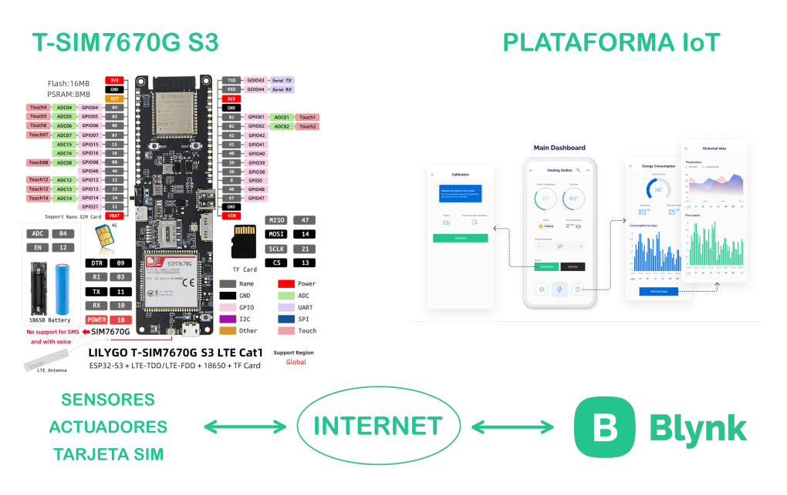
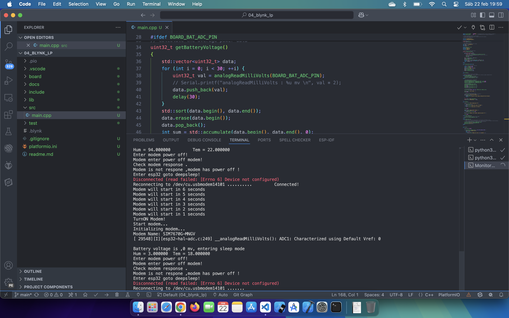

## Comunicación con Blynk Low Power 

La idea es sólo enviar datos periódicamente (cada 30 segundos en el código para pruebas) y pasar el resto del tiempo en modo dormido para poder alimentar el dispositivo con batería.

El resultado ha sido el siguiente:

  

  

