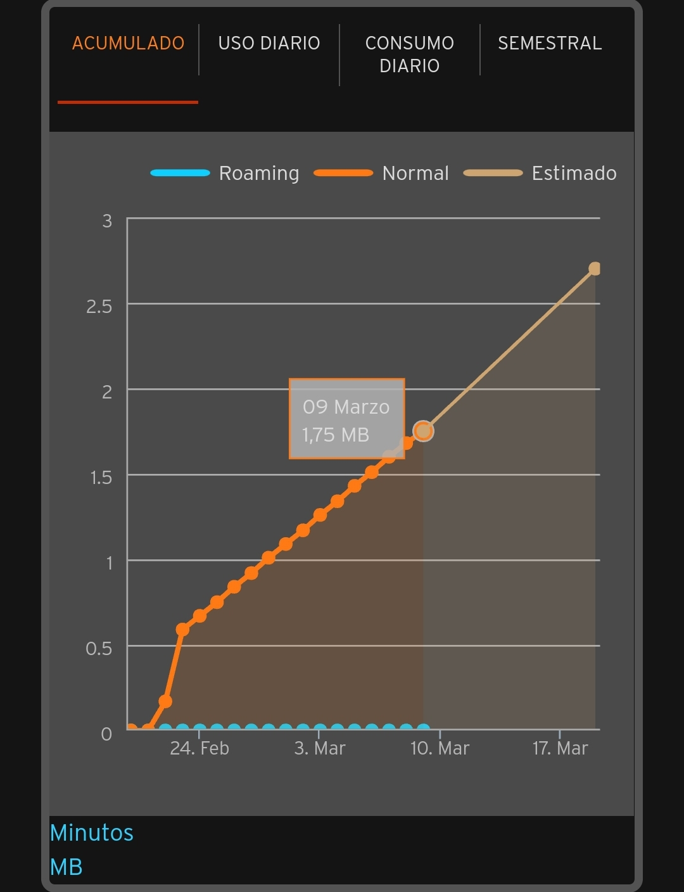
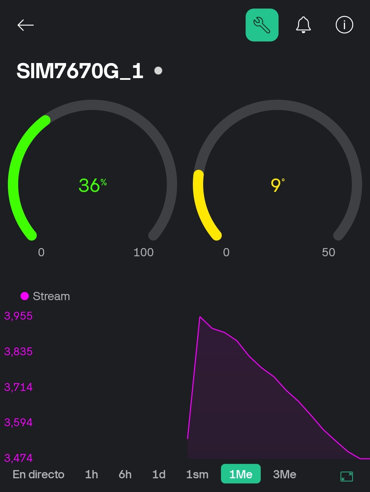
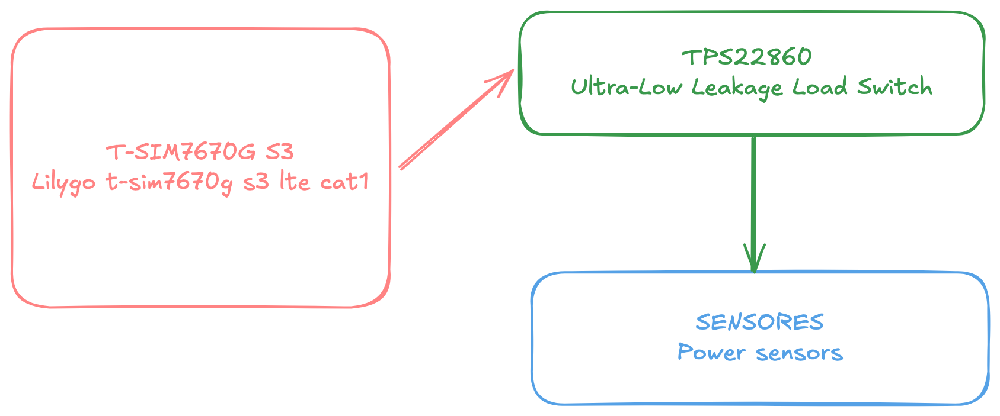

## Comunicación con Blynk Low Power 

La idea es sólo enviar datos periódicamente (cada 30 segundos en el código para pruebas) y pasar el resto del tiempo en modo dormido para poder alimentar el dispositivo con batería.

El resultado ha sido el siguiente:

  

  

  

He estado probando durante dos semanas el envío de datos a Blynk cada 15 minutos con una pila 18650 de 2800 mA. No hay ningún sensor conectado, la batería ha aguantado y el consumo de datos de la tarjeta sim es muy pequeño. Objetivo conseguido. 

| Consumo de datos | Blynk |
|----------|----------|
|  |  |

## Conexión de alimentación de sensores 

El siguiente paso es conectar sensores pero de una forma eficiente y que no consuman corriente mientras no se estén leyendo. Asi que el TPS22860 será el interruptor de la alimentación de los sensores y controlado por el ESP32S3. 

  

  
